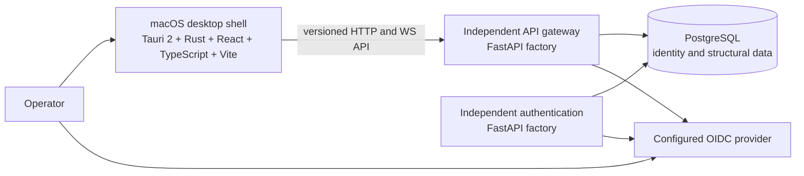

# System Context

## Objectives

Define the authorized Milestone 3 boundary: a minimal macOS desktop client and
independently operated authentication and API gateway processes. The desktop is
a client of stable server contracts, not a process supervisor or deployment
path.

No previous product code was reused. Milestone 1 established the repository
foundation; Milestone 2 defines shared contracts and the authoritative
PostgreSQL model; Milestone 3 adds the bounded identity runtime.

## System boundary



React and TypeScript are built by Vite. Tauri 2 and Rust provide a narrow native
shell for Keychain token/device storage, validated browser login launch, and a
fixed deep-link callback. Python 3.12+ and FastAPI provide separate
authentication and gateway factories with health, observability, OIDC, session,
device, RBAC, and ticketed WebSocket behavior.

## Files

- `.github/` owns repository policy, CI, dependency update policy, and ownership.
- Root governance and tool files define contribution, security, automation, and
  Python quality policy.
- `docker-compose.yml` and `infrastructure/` define local dependencies,
  observability, health checks, and deployment ownership boundaries.
- `apps/macos-desktop/` contains the minimal client; other app boundaries remain
  README-only.
- `backend/`, `services/authentication/`, and `services/api-gateway/` contain the
  authorized backend runtime.
- `packages/shared-types/` and `packages/event-contracts/` own versioned
  language-neutral contracts.
- `infrastructure/database/` owns PostgreSQL metadata and migrations.
- `packages/auth-contracts/` and `packages/api-client/` own the auth contract and
  constrained client.
- `docs/architecture/SYSTEM_CONTEXT.md` owns external actors and boundaries.
- `docs/architecture/REPOSITORY.md` owns the planned repository layout.
- `docs/security/FOUNDATION.md` owns the initial threat and control baseline.
- `docs/deployment/` owns local environment and macOS toolchain guidance.
- `docs/testing/STRATEGY.md` owns the future test pyramid and evidence rules.
- `docs/operations/MILESTONE_1.md` is the milestone evidence and gate record.
- `docs/operations/MILESTONE_2.md` records contract/database evidence.
- `docs/operations/MILESTONE_3.md` records runtime evidence and the pending gate.

There is no broker, market-data, strategy, order, execution, risk,
reconciliation, AI, signing, notarization, DMG, or updater runtime.

## Commands

The architecture is documentation-only. Review it locally with:

```sh
pre-commit run --all-files --show-diff-on-failure
```

CI validates `docker-compose.yml`, starts its declared local
dependencies with `docker compose up --detach --wait`, verifies every container
health status, and tears the stack down after the check.

## Tests

- Markdown syntax and formatting through pre-commit.
- Required-section enforcement in `foundation.yml`.
- Human architecture review for boundary clarity.
- Versioned contract validation and compatibility tests.
- PostgreSQL migration and constraint tests.
- Independent server factory and lifecycle tests with no desktop process.

## Results

- Focused architecture, runtime contract, and independent factory tests: PASS.
- Final full Milestone 3 acceptance: PENDING.

Focused results do not imply full acceptance.

## Known issues

- A production OIDC provider registration remains a deployment input.
- The gateway currently composes the auth surface in-process; network service
  identity is deferred.
- Offline desktop behavior is not implemented; update delivery is excluded.
- Deployment topology and availability targets remain open.

## Security

Trust boundaries exist at the desktop/server API, server/data services, and
server/external service edges. The desktop is an untrusted client: authorization
must be enforced by FastAPI on every protected operation. Native Tauri commands
must use an allowlist and must not expose general shell or filesystem access.
Secrets belong in deployment secret stores, never in Vite bundles, Tauri source,
repository files, logs, or desktop-managed server processes.

The server continues independently of the desktop. Closing, uninstalling, or
failing the desktop must not stop the server or invalidate server availability.

## Acceptance

- Tauri/Rust/React/TypeScript/Vite and Python/FastAPI responsibilities are
  explicit.
- The desktop and server lifecycles are independent.
- Trust boundaries and untrusted-client assumptions are identified.
- Out-of-scope runtimes remain explicitly excluded.
- Focused test success is not represented as final acceptance.

Milestone 3 authorization is limited to identity, transport, observability, and
the minimal desktop shell.

## Next milestone

Milestone 4 is not authorized. Broker, market, strategy, order, execution, risk,
reconciliation, AI, signing, notarization, DMG, and updater work remain
excluded.
