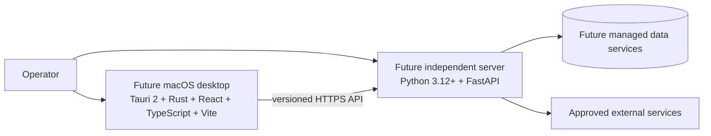

# System Context

## Objectives

Define the product boundary before application code exists. The planned product is
a macOS desktop client backed by an independently deployable server. The desktop
must remain a client of stable server contracts; it must not become the server's
process supervisor or sole deployment path.

No previous product code was reused for this foundation. Milestone 1 contains
the complete 54-file repository foundation: governance, local dependency
infrastructure, ownership boundaries, validation, and design evidence.

## System boundary



The future React and TypeScript application is built by Vite. Tauri 2 and Rust
supply the macOS native shell and narrowly scoped native capabilities. Python
3.12+ and FastAPI supply the independent network API, business orchestration,
authentication enforcement, and health endpoints. These choices describe the
intended Milestone 2 direction; no runtime implementation is authorized in
Milestone 1.

## Files

- `.github/` owns repository policy, CI, dependency update policy, and ownership.
- Root governance and tool files define contribution, security, automation, and
  Python quality policy.
- `docker-compose.yml` and `infrastructure/` define local dependencies,
  observability, health checks, and deployment ownership boundaries.
- `apps/`, `services/`, and `packages/` contain README-only ownership boundaries.
- `docs/architecture/SYSTEM_CONTEXT.md` owns external actors and boundaries.
- `docs/architecture/REPOSITORY.md` owns the planned repository layout.
- `docs/security/FOUNDATION.md` owns the initial threat and control baseline.
- `docs/deployment/` owns local environment and macOS toolchain guidance.
- `docs/testing/STRATEGY.md` owns the future test pyramid and evidence rules.
- `docs/operations/MILESTONE_1.md` is the milestone evidence and gate record.

All repository scaffolding and local dependency infrastructure are approved
Milestone 1 deliverables. There is no application, backend, frontend, Rust,
packaging, app, or DMG source yet.

## Commands

The architecture is documentation-only. Review it locally with:

```sh
pre-commit run --all-files --show-diff-on-failure
```

CI validates `docker-compose.yml`, starts its declared local
dependencies with `docker compose up --detach --wait`, verifies every container
health status, and tears the stack down after the check.

## Tests

- Markdown syntax and formatting through pre-commit.
- Required-section enforcement in `foundation.yml`.
- Human architecture review for boundary clarity.
- Future contract tests between desktop and server.
- Future server deployment test with no desktop process present.

## Results

- Architecture and repository contract review: PASS.
- Desktop/server contract and independent server deployment tests: NOT
  APPLICABLE to Milestone 1; no product source or API contract is authorized.
- Dependency configuration, health, teardown, and restart recovery: PASS.

No runtime success is inferred from static documentation validation.

## Known issues

- Authentication provider, data store, queue, and external integrations are not
  selected.
- API versioning and compatibility windows are not yet specified.
- Offline desktop behavior and update delivery are undecided.
- Deployment topology and availability targets remain open.

## Security

Trust boundaries exist at the desktop/server API, server/data services, and
server/external service edges. The desktop is an untrusted client: authorization
must be enforced by FastAPI on every protected operation. Native Tauri commands
must use an allowlist and must not expose general shell or filesystem access.
Secrets belong in deployment secret stores, never in Vite bundles, Tauri source,
repository files, logs, or desktop-managed server processes.

The server continues independently of the desktop. Closing, uninstalling, or
failing the desktop must not stop the server or invalidate server availability.

## Acceptance

- The future Tauri 2/Rust/React/TypeScript/Vite and Python 3.12+/FastAPI
  responsibilities are explicit.
- The desktop and server lifecycles are independent.
- Trust boundaries and untrusted-client assumptions are identified.
- Runtime evidence is marked NOT RUN or BLOCKED.
- No application implementation is represented as complete.

Milestone 1 acceptance does not authorize Milestone 2.

## Next milestone

Milestone 2 may begin only after an explicit gate decision recorded by an
authorized maintainer. Candidate work includes API contracts, an independently
runnable Python 3.12+ FastAPI skeleton, a Tauri 2/Rust/React/TypeScript/Vite
shell, dependency definitions, and contract tests. Until that decision, all
Milestone 2 implementation is unauthorized.
